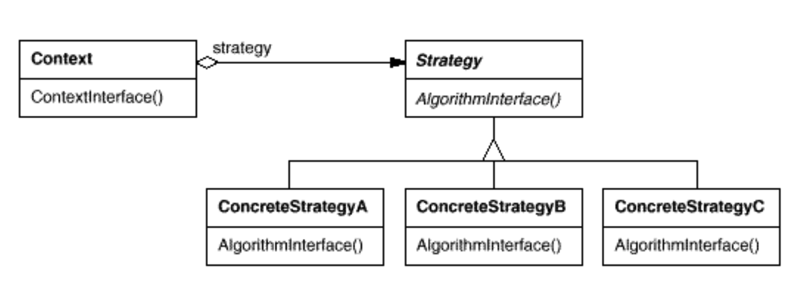

## strategy

- Definition

>Define a family of algorithms, encapsulate each one, and make theminterchangeable. Strategy lets the algorithm vary independently fromclients that use it.

- Structure

参考 
[策略模式原来这么简单](https://juejin.im/post/5c25b8bcf265da61117a5ea1#heading-1)
