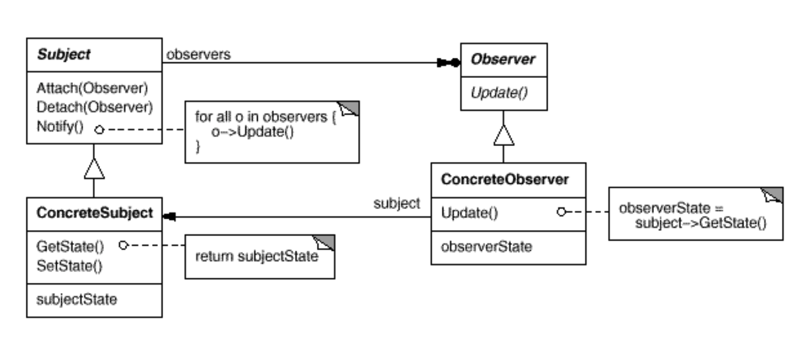

## Observer

### Intent

Define a **one-to-many** dependency between objects so that when one object changes state, all its dependents are notified and updated automatically.

### Motivation

A common side-effect of partitioning a system into a collection of cooperating classes is the need to maintain consistency between related objects. 
You don't want to achieve consistency by making the classes tightly coupled, because that reduces their reusability.

动机的说明非常清楚，就是当我们把系统自上而下的划分为一些相互协作的模块时，这些模块进行一致性通信时面临的问题。
作者举了一个非常好的例子，就是数据图表的case。多份数据图表之间相互独立，但是他们底层的数据是共享的，所以存在这样一种一对多的关系。
但是，如果我们把数据和上层展示耦合到一块时，我们就会发现这会导致代码的重用性很低。每增加一个展示，需要增加对应的底层数据。

### Applicability

- When an abstraction has two aspects, one dependent on the other.Encapsulating these aspects in separate objects lets you vary and reuse them independently.
- When a change to one object requires changing others, and you don't know how many objects need to be changed.
- When an object should be able to notify other objects without making assumptions about who these objects are. In other words, you don't want these objects tightly coupled.

### Structure



### Participants

- Subject
  - knows its observers. Any number of Observer objects may observe a subject.
  - provides an interface for attaching and detaching Observer objects.
- Observer
  - defines an updating interface for objects that should be notified
- Concreate Subject
  - stores state of interest to ConcreteObserver objects.
  - sends a notification to its observers when its state changes.
- Concrete Observer
  - maintains a reference to a Concrete Subject object.
  - stores state that should stay consistent with the subject's.
  - implements the Observer updating interface to keep its state consistent with the subject's.

一些需要说明的地方：
1. attach/detach方法必须提供，这可以避免形成cycle references.
2. concreate subjects, sends a notification to its observers when its state changes. 这里是需要我们提供OnPublish方法
3. concreate observer也会保留需要和subject进行同步的数据状态。但是，这本质会造成数据冗余，同一份数据，存了多份。

### Consequences

q:observer pattern有哪些优点？
>The Observer pattern lets you vary subjects and observers independently.
You can reuse subjects without reusing their observers, and vice versa.
It lets you add observers withoutmodifying the subject or other observers.
>
>1.Abstract coupling between Subject and Observer.(这句话想表达的是subject和observer是一种弱耦合的关系)
2.Support for broadcast communication

q:observer pattern有哪些缺点?
>Unexpected updates.
Because observers have no knowledge of each other's presence, they canbe blind to the ultimate cost of changing the subject.

### Implementation

对于实现，还有一些细节值得进一步讨论，我在此只简单总结，不展开。

1. Mapping subjects to their observer
2. Observing more than one subject
3. Who triggers the update?
4. Dangling references to deleted subjects(weak_ptr解决)
5. Making sure Subject state is self-consistent beforenotification(实践中，NVI可以解决)


### A short summary

这个小节讲了observer pattern的知识，本质是关于design pattern但是对于我来说有另外的一些收获
- 成员函数作为改变自身状态的行为，对于这个理解，我没有什么问题。但是，用它来作为类/对象消息通信的方式，对于这种理解，在这个例子中显示的非常充分。
- 承接第一点，通常在一个类当中，保留另一个类的引用，以前我的理解更多的是借助这个引用类来实现一些东西。通过这个例子，看到了作为对象通信的这样一种方式。

### 实践

- demo-01

这是一个错误的实践，但是我保留了这个demo的原因在于，这个demo犯了一些值得思考的错误

1. 编译通不过。
```cpp
demo-01/mcall_subscriber.cc:8:38: error: member access into incomplete type 'dp::Publisher'
  const PerformanceData& data = p_sub->GetData();
```
2. 对于Update接口理解有误。编译之所以通不过，根本原因在于对于update接口理解有误，subscriber并不是通过update接口来获取
publisher的state，update接口的语义只是publisher用来消息通知subsriber，数据更新了。subscriber可以进行同步。
3. 为什么update接口不能在消息提醒的同时，进行数据同步。确实，我一开始也是这么理解的，原因在于，相互引用的存在，导致subscriber/publisher必须有一个采用forward declaration，这会间接导致incomplete type. 从而不能对其成员进行访问。
我想这也是为什么publisher还是要保留一个指向subscriber的根本原因，因为实际的操作不允许通过update接口来获取状态。
4. EventLoop的逻辑没有问题，但是这需要publisher和subscriber单独启动一个程序，逻辑上也确实是这样的，但是在我目前的测试程序里还无法实现。

- demo-02

给出了一版正确实现，不过和书上的实现，有一些区别以及一些需要注意的点：
1. 采用NVI的手法，确保notify一定要在setstate之后被调用
2. concreate_subscriber当中保留了concreate_publisher的引用，而不是一个基类指针。当然，保存基类指针也没有问题，只不过没有必要。
3. Update接口没有保留publisher引用。就是保留这个接口原本的语义。书上的做法是为了判断subscriber是否是对应的publisher

- demo-03(best practice)

采用了smart pointer来解决问题，但是在解决的时候碰到一些问题
1. McallSubScriber在构造和析构的时候，对于PerformancePublish对象进行Attach/Detach操作，但是此时无法传递合适的smart pointer.因为，this是T*的形式，不可能通过它再构造一个smart pointer，这是错误用法
2. 所以对于1种的问题，并没有教条处理。Publisher的接口还是采用T*形式的参数，因为我确定在这个操作里面并不需要释放
3. 最好确保能完成管理dynamic memory的任务即可。

- demo-04

这个demo比价特殊，为了使用weak_ptr而使用weak_ptr,所以不是最佳实践，只是为了说明weak_ptr的用途。demo-03中需要显式detach，但是demo-04则不需要了

1. Detach()函数需要删除，有他在，则不会形成cycle references.
2. publisher保留了对于mcall_subscriber的引用，mcall_subscriber保留了对于performance_publisher的引用，那么到底应该让谁采用weak_ptr呢？<br>
2.1. mcall_subscriber保留performance_publisher的引用时为了进行数据同步，如果后者销毁，那么前者则不能同步数据。即前者对后者的生命周期是关心的<br>
2.2. publisher对于mcall_subscriber的生命周期也关心，但没有那么关心，因为后者销毁，只是少了一个notify的对象，并不会用它进行什么数据更新<br>
2.3. 这里，effective modern cpp当中也给了建议，Subjects have no interest in control‐ ling the lifetime of their observers，but they have a great interest in making sure that if an observer gets destroyed, subjects don’t try to subse‐ quently access it.
2.4. 2.3这句话看似矛盾，那到底是关心还是不关心，应该这么说，observer的生命周期，不由subject决定。只不过，当observer销毁时，需要告诉subject<br>
