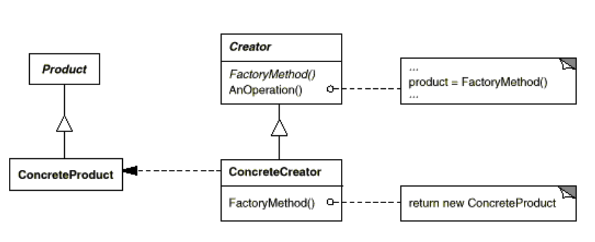

## factory method

### Intent

q:策略模式的定义是什么?如何理解
>Define an interface for creating an object, but let subclasses decide which class to instantiate. Factory Method lets a class defer instantiation to subclasses.
>
>就目前理解而言，我觉得为创建对象单独定义一个接口，这句话我理解更深一点。

### Motivation(why)

q:rt?
>作者在文章中先是举了一个例子，
特定Document和特定应用相关，所以，对于Application而言，不可能预测到底哪一个Document将被实例化。
Application只知道，一个新的文档何时被创建，但是不知道具体是哪一个Document将被创建。
>
>factory method提供了一个办法是，它封装了哪一个Document将被创建出来的信息，并将该信息从框架中分离出来。
具体来说，就是将这部分信息封装到Application的子类当中。
>
>这是作者举的例子。我自己的看法则是工厂模式的优点，结合base-demo来说，CrateMaze采用硬编码的方式，不够灵活。
工厂模式则是把对象的创建过程，从CrateMaze当中解耦出去了。
即使用者不用关心对象的创建过程，因为工厂模式将对象的创建过程解耦出去，使用者只用关心拿到对象之后的应用逻辑即可
>
>这又牵扯另一个问题，对象的创建调用构造函数即可，为什么需要解耦呢。两个方面：
1. Maze这一类对象的创建过程相对复杂。不是一个构造函数能解决的。构造函数只能把对象初始化为0，并不是一个真正可以调用的对象
2. 直接使用对象构造函数是硬编码，如果不用这个对象，代码需要修改。如果改用工厂方法则代码有可重用性。

### Structure

### Participants

- Product (Document)
  - defines the interface of objects the factory method creates.
- ConcreteProduct (MyDocument)
  - implements the Product interface.
- Creator (Application)
  - declaresthefactorymethod,whichreturnsanobjectoftypeProduct.Creator may also define a default implementation of the factory method that returns a default ConcreteProduct object.
- ConcreteCreator (MyApplication)
  - overrides the factory method to return an instance of a ConcreteProduct.

### Consequences

从常规理解角度，
- 优点：将与特定应用有关的类代码，从调用代码中解耦。调用者不关心对象具体的创建过程。这样可以保证调用者代码的重用性。
- 缺点：仅仅为了创建一个特定的ConcreateProduct就不得不创建ConcreateCreator

另外两种效果
- Provides hooks for subclasses.
- Connects parallel class hierarchies.

### Implementation

原则：**用一个独立的操作创建对象，这样子类才能重定义他们的创建方式**

下面是一些建议：
- c++中的factory method通常都是virtual function，并且常常是pure virtual function.(ec::Rule34，实践中也是建议多写pure virtuao function)
