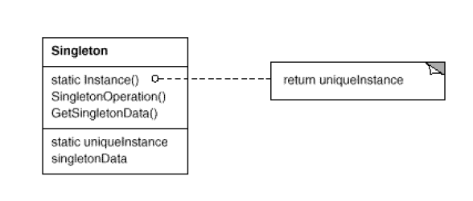

[TOC]
## Singleton

### Intent

q:rt?
>Ensure a class only has one instance, and provide a global point of access to it.
>
>这里有一点需要特别注意的是，global point of access，即提供一个全局入口。一个自然的想法是，我直接提供一个全局对象不就好了。
只要client不要再定义全局对象，即可保证全局唯一。
显然，这样的做法有明显的缺点就是，全局对象的作用域没有得到限制，也就是正常全局对象的缺点

### Motivation
q:rt?
>It's important for some classes to have exactly one instance.
A better solution is to make the class itself responsible for keeping track of
its sole instance. The class can ensure that no other instance can be created
(by intercepting requests to create new objects), and it can provide a way to
access the instance. This is the Singleton pattern.

### Applicability
q:rt?
Use the Singleton pattern when
1. there must be exactly one instance of a class, and it must be accessible
to clients from a well-known access point.
2. when the sole instance should be extensible by subclassing, and clients
should be able to use an extended instance without modifying their code.

这里特别注意，dp原文对于派生能力也给出了要求。

参考<br>
[Thread-Safe Initialization of Data](https://www.modernescpp.com/index.php/thread-safe-initialization-of-data)

### Structure



### Participants

- singleton
  - defines an Instance operation that lets clients access its unique
instance. Instance is a class operation (that is, a class method
in Smalltalk and a static member function in C++).
  - may be responsible for creating its own unique instance.

### Collaborations

Clients access a Singleton instance solely through Singleton's Instance
operation.

### Consequences

The Singleton pattern has several benefits:
- Controlled access to sole instance.
- Reduced name space.
- Permits refinement of operations and representation.
- Permits a variable number of instances.
- More flexible than class operations.

Moreover, static member functions in C++ are never virtual, so subclasses
can't override them polymorphically.

### Implementation

这里以我自己的讨论为主。上文介绍到这里需要一个class method，对于这个没有问题。但是，copy-control member应该怎么实现，这里需要进一步讨论

#### Prohibiting Heap-Based Objects(Stack/Static objects is allowed)

下面代码说明，只把ctor/dtor放入private，不起作用。ctor是为了禁止构造，但是可以通过friend escape.
dtor放入private是为了模仿stack obj的禁止方式，但是对于heap obj来说，需要进行显示调用delete才能触发dtor，所以不显示调用时，并不能禁止heap obj的生成。
即使显示调用，任然有friend escape.

```cpp
#include <iostream>

class Foo {
 public:

  int data() const { return data_; }
  friend void GetFoo();
 private:
  explicit Foo(int data) : data_(data) {}
  int data_ = 8;
};

void GetFoo() {
  Foo* pfoo = new Foo(3);
  std::cout << pfoo->data() << std::endl;
  delete pfoo;
}

int main(void) {
  GetFoo();
  return 0;
}
```

下面代码则起到了作用，根据more ec item27的说明
>Preventing clients from directly instantiating objects on the heap is
easy, because such objects are always created by calls to new and you
can make it impossible for clients to call new.

这里还补充道：
>It suffices to declare operator new private, but it looks strange to have
operator new be private and operator delete be public, so unless
there’s a compelling reason to split up the pair, it’s best to declare
them in the same part of a class.

```cpp
#include <iostream>

class Foo {
 public:
  explicit Foo(int data) : data_(data) {}

  int data() const { return data_; }

  friend void GetFoo();

 private:
  static void* operator new(size_t size);
  static void operator delete(void* ptr);

 private:
  int data_ = 8;
};

void GetFoo() {
  Foo* pfoo = new Foo(3);
  std::cout << pfoo->data() << std::endl;
  delete pfoo;
}

int main(void) {
  GetFoo();
  return 0;
}

```

总结，要生成stack only object
- It suffices to declare operator new private(it’s best to declare them in the same part of a class)
- declare operator new[] and operator delete[] private
- other copy control member is normal.

#### Requiring Heap-Based Objects(Stack/Static objects is forbidden)

看如下代码，ctor放入private并没有解决问题，friend escape.同时，这么做会禁止heap obj的构造。

```cpp
#include <iostream>

class Foo {
 public:

  int data() const { return data_; }

  friend void FooPrint();

 private:
  explicit Foo(int data) : data_(data) {}
  int data_ = 8;
};

void FooPrint() {
  Foo foo(3);
  std::cout << foo.data() << std::endl;
}

int main(void) {
  FooPrint();
  return 0;
}
```

我们将dtor放入private，则stack obj被完全禁止。但此时，heap obj的析构受到影响，因为类外不可见dtor.

```cpp
#include <iostream>

class Foo {
 public:
  explicit Foo(int data) : data_(data) {}

  int data() const { return data_; }

  friend void FooPrint();
 private:
  ~Foo();
  int data_ = 8;
};

void FooPrint() {
  Foo foo(3);
  std::cout << foo.data() << std::endl;
}

int main(void) {
  FooPrint();
  return 0;
}
```

此时需要给定一个public destory接口，在destory接口内，调用dtor。此时在类内作用于，可行

```cpp
#include <iostream>

class Foo {
 public:
  explicit Foo(int data) : data_(data) {}
  void Dtor()  { delete this; }

  int data() const { return data_; }

  friend void FooPrint();
 private:
  ~Foo() = default;
  int data_ = 8;
};

int main(void) {
  Foo* p = new Foo(3);
  std::cout << p->data() << std::endl;
  p->Dtor();
  return 0;
}
```

总结，要生成heap only obj:
- private dtor with implementation
- public destory func to call dtor.
- other copy control member is normal.

#### Scott Meyer's Implementation(Static variables with block scope)

```cpp
#ifndef SINGLETON_H_
#define SINGLETON_H_

// Scott Meyer's Singleton

class Singleton {
 public:
  Singleton(const Singleton&) = delete;
  Singleton& operator=(const Singleton&) = delete;

  static Singleton& GetInstance() {
    static Singleton s;
    return s;
  }

 private:
  Singleton() = default;
  ~Singleton() = default;
};

#endif  // SINGLETON_H_
```

- copy control member
  - private dtor with default implementation
    - private保证stack obj forbidden
    - default implementation 保证static obj构造成功，所以必须有default inplementation
  - private default ctor with default implementation
    - private保证heap obj forbidden(原始的禁止heap obj做法不是这样，但是当前做法也可以达到目的，不提供friend method)
    - default implementation 保证static obj析构成功
  - copy semantics is delete.
- Static GetInstance method(global point of access)
- Static variables with block scope(a class only has one instance)
    - c++11保证初始化的线程安全
    - local static var只构造一次，保证单例
      - static method不能保证单例，该方法可以保证对象共享，但是方法内部的local stack obj并不是单例
      - 多个线程可能访问时，有不同的local stack obj。
      - local static obj只构造一次，有可能是单例。但是如果多线程并发初始化时，也不是单例
        - c++11保证是单例 
        - c++03不保证

q:why?
>If control enters the declaration concurrently while the variable is being initialized, the concurrent execution shall wait for completion of the initialization.

参考<br>
[C++ Singleton design pattern](https://stackoverflow.com/questions/1008019/c-singleton-design-pattern) 非常详尽的讨论<br>
[Meyer’s Singleton](http://laristra.github.io/flecsi/src/developer-guide/patterns/meyers_singleton.html)<br>
[Is Meyers' implementation of the Singleton pattern thread safe?](https://stackoverflow.com/questions/1661529/is-meyers-implementation-of-the-singleton-pattern-thread-safe)<br>

#### Chenshuo's Implementation(The function call_once in combination with the once_flag)

chenshuo给出的实现，主要是针对c++98/c++03的版本，基本思路是The function call_once in combination with the once_flag
但是，由于c++98/c++03并不支持，所以是借助pthread库对应变量来实现，从而代码也不跨平台。当然，c++98/c++03不支持Static variables with block scope

**pthread_once/pthread_once_t替换c++11当中的std::call_once/std::once_flag**

```cpp
#ifndef SINGLETON_H_
#define SINGLETON_H_

#include <pthread.h>

// Chenshuo's Singleton
class Singleton {
 public:
  static Singleton& GetInstance() {
    pthread_once(&once_flag_, &Singleton::Init);
    return *s_;
  }

 private:
  Singleton() {}
  ~Singleton() {}

  Singleton(const Singleton&);
  Singleton& operator=(const Singleton&);

  static void Init() { s_ = new Singleton(); }

  static pthread_once_t once_flag_;
  static Singleton* s_;
};

pthread_once_t Singleton::once_flag_ = PTHREAD_ONCE_INIT;

Singleton* Singleton::s_ = NULL;

#endif  // SINGLETON_H_

```

- copy control member
  - private dtor with default implementation
    - private保证stack obj forbidden
    - default implementation 保证static obj构造成功，所以必须有default inplementation
  - private default ctor with default implementation
    - private保证heap obj forbidden(原始的禁止heap obj做法不是这样，但是当前做法也可以达到目的，不提供friend method)
    - default implementation 保证static obj析构成功
  - copy semantics is delete.
  - 由于c++98/c++03不支持delete/default
    - ctor/dtor采用显示给出default implentation.
    - using private undefined ones instead of delete.
- Static GetInstance method(global point of access)
- The function call_once in combination with the once_flag
  - pthread_once/pthread_once_t替换c++11当中的std::call_once/std::once_flag
- No public destory interface.
  - 可以提供public destroy interface, 成员函数可以调用dtor
  - chenshuo没有给出的原因如下
    - 长时间稳定运行的服务器上没有必要销毁这个对象，在短时间运行的场景下，程序退出自然对象就被释放
    - 如果用户不小心调用了析构函数，那么这个单例模式就没有用了

参考<br>
[再探线程安全的单例模式实现](https://irvingow.github.io/2019/07/24/%E5%86%8D%E6%8E%A2%E7%BA%BF%E7%A8%8B%E5%AE%89%E5%85%A8%E7%9A%84%E5%8D%95%E4%BE%8B%E6%A8%A1%E5%BC%8F%E5%AE%9E%E7%8E%B0/)<br>
[pthread_once](https://linux.die.net/man/3/pthread_once)

#### Double-checked Locking Pattern

这一小节先简单讨论，记住结论即可。

```cpp
Singleton* Singleton::instance() {
  if (pInstance == 0) { // 1st test
    Lock lock;
    if (pInstance == 0) { // 2nd test
      pInstance = new Singleton;
    }
  }
  return pInstance;
}
```

以上是dclp的实现，这么做的原因是，在最外层判断加锁的逻辑，实现是正确的，但是开销很大。因为大部分场景都是只读的场景，没有必要加锁。
所以，才有了dclp的做法，即如果是读场景(!pInstance)，那么不加锁，直接获取。这里的逻辑没有问题，问题出在写这里。

This statement causes three things to happen:
- Step 1: Allocate memory to hold a Singleton object.
- Step 2: Construct a Singleton object in the allocated memory.
- Step 3: Make pInstance point to the allocated memory.

Of critical importance is the observation that compilers are not constrained
to perform these steps in this order! In particular, compilers are sometimes
allowed to swap steps 2 and 3.

```cpp
Singleton* Singleton::instance() {
  if (pInstance == 0) {
    Lock lock;
    if (pInstance == 0) {
      pInstance = // Step 3
      operator new(sizeof(Singleton)); // Step 1
      new (pInstance) Singleton; // Step 2
    }
  }
  return pInstance;
}
```

- Thread A enters instance, performs the first test of pInstance, acquires
the lock, and executes the statement made up of steps 1 and 3. It is then
suspended. At this point pInstance is non-null, but no Singleton object
has yet been constructed in the memory pInstance points to.
- Thread B enters instance, determines that pInstance is non-null, and
returns it to instance’s caller. The caller then dereferences the pointer
to access the Singleton that, oops, has not yet been constructed.

q:真正的原因到底是什么？
>DCLP will work only if steps 1 and 2 are completed before step 3 is performed, but there is no way to express this constraint in C or C++. That’s the dagger in the heart of DCLP: we need to define a constraint on relative instruction ordering, but our languages give us no way to express the constraint
>
>Nothing you do can alter the fundamental problem: you need to be able
to specify a constraint on instruction ordering, and your language gives you no
way to do it

本质是instruction ordering，但是语言层面无法提供我们机制来避免编译器进行指令重排的优化

参考
[C++ and the Perils of Double-Checked Locking](https://www.aristeia.com/Papers/DDJ_Jul_Aug_2004_revised.pdf)